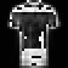
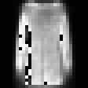
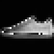

# Fashion Item Generator

[](https://fashionitem.streamlit.app/)
[](https://www.python.org/downloads/)
[](https://pytorch.org/)
[](https://fastapi.tiangolo.com/)
[](https://opensource.org/licenses/MIT)

A deep learning toolkit for Fashion-MNIST classification and generation. Features a CNN classifier (95.1% accuracy), conditional VAE for image generation, latent space interpolation, and style transfer capabilities.

**Live Demo:** [fashionitem.streamlit.app](https://fashionitem.streamlit.app/)

## Samples

<p align="center">
  
  
  
</p>
<p align="center"><em>Latent space interpolation between fashion classes</em></p>

## Features

- **Image Classification** - CNN with 95.1% accuracy on Fashion-MNIST
- **Image Generation** - Conditional VAE generates clothing items by category
- **Latent Space Interpolation** - Smooth transitions between any two classes with GIF export
- **Style Transfer** - Restyle any image to look like a different clothing category
- **REST API** - FastAPI endpoints for inference
- **Interactive Demo** - Streamlit web interface with all features

## Models

| Model | Parameters | Performance |
|-------|------------|-------------|
| CNN   | 1.2M       | 95.1% accuracy |
| VAE   | 3.7M       | A+ grade (0.93 correlation) |

## Installation

### With Conda (recommended)

```bash
git clone https://github.com/josepeon/fashion_item_generator.git
cd fashion_item_generator
conda env create -f environment.yml
conda activate fashion_mnist_env
```

### With pip

```bash
git clone https://github.com/josepeon/fashion_item_generator.git
cd fashion_item_generator
pip install -r requirements.txt
```

## Quick Start

### Demo

```bash
python src/demo.py
```

### Streamlit App

```bash
cd src && streamlit run app.py --server.port 8501
```

Open [localhost:8501](http://localhost:8501) for the interactive demo with:
- **Classify** - Upload an image for classification
- **Generate** - Create new images by class
- **Interpolate** - Morph between two classes with GIF export
- **Style Transfer** - Restyle images to any category

### REST API

```bash
cd src && python api.py
```

API runs on [localhost:8080](http://localhost:8080). Interactive docs at [localhost:8080/docs](http://localhost:8080/docs).

| Endpoint | Method | Description |
|----------|--------|-------------|
| `/classify` | POST | Upload image → classification results |
| `/generate` | POST | Class ID → generated images (base64) |
| `/health` | GET | Service health check |
| `/classes` | GET | List all 10 classes |

## Project Structure

```
fashion_item_generator/
├── src/
│   ├── models/
│   │   ├── cnn.py              # FashionCNN classifier
│   │   └── vae.py              # FashionVAE generator
│   ├── train_cnn.py            # CNN training script
│   ├── train_vae.py            # VAE training script
│   ├── evaluate_cnn.py         # CNN evaluation
│   ├── evaluate_vae.py         # VAE evaluation
│   ├── demo.py                 # Quick demo
│   ├── api.py                  # FastAPI server
│   └── app.py                  # Streamlit app
├── weights/                    # Trained model weights (gitignored)
├── data/                       # Fashion-MNIST dataset (auto-download)
├── results/                    # Evaluation outputs
├── environment.yml             # Conda environment
└── requirements.txt            # Pip dependencies
```

## Architecture

### CNN Classifier

```
Input (28×28) → Conv Blocks (64→128→256) → Global Avg Pool → FC (256→10)
```

- 3 convolutional blocks with batch normalization
- Global average pooling (no flattening)
- Single fully-connected layer
- Test-time augmentation (TTA) for evaluation

### VAE Generator

```
Input (784) + Label (10) → Encoder (512→256→32) → Latent → Decoder (32→256→512→784)
```

- Conditional on class labels (one-hot encoded)
- 32-dimensional latent space
- Residual blocks with LayerNorm
- Spherical linear interpolation (SLERP) for smooth transitions
- Soft label decoding for interpolation blending

## Training

```bash
python src/train_cnn.py     # ~150 epochs, reaches 95%+
python src/train_vae.py     # ~150 epochs
```

Both scripts support MPS (Apple Silicon) and CUDA acceleration.

## Results

### CNN Per-Class Accuracy

| Class | Accuracy | Class | Accuracy |
|-------|----------|-------|----------|
| T-shirt/top | 91.2% | Sandal | 99.1% |
| Trouser | 99.5% | Shirt | 83.7% |
| Pullover | 92.4% | Sneaker | 98.2% |
| Dress | 95.3% | Bag | 99.7% |
| Coat | 94.7% | Ankle boot | 97.0% |

### VAE Metrics

| Metric | Value |
|--------|-------|
| MSE | 0.040 |
| Correlation | 0.934 |
| Diversity | 20.8 |

## Tech Stack

- **PyTorch** - Deep learning framework
- **FastAPI** - REST API server
- **Streamlit** - Interactive web demo
- **NumPy** - Numerical computing
- **Pillow** - Image processing
- **Matplotlib** - Visualization

## Requirements

- Python 3.10+
- PyTorch 2.0+
- MPS (Apple Silicon) or CUDA supported

## License

MIT License - see [LICENSE](LICENSE) for details.
